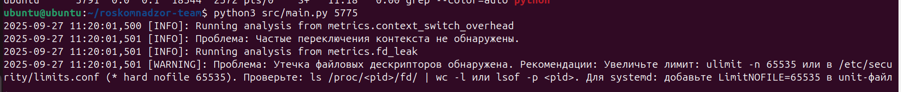
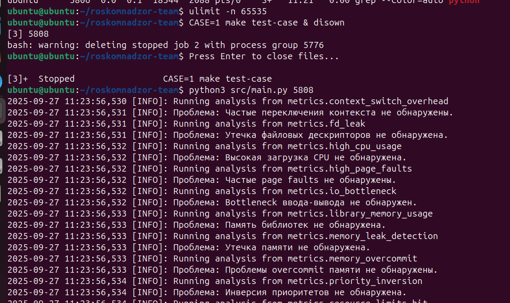

# roskomnadzor-team

## Кейс

### Tears in Rain

#### Проблема

Существуют различные условия эксплуатации приложений, в том числе в условиях, не всегда описанных в документации, или вообще без документации. Это может приводить к падению производительности, появлению непонятных узких мест.
 
#### Ожидаемый результат

По результатам решения кейса ожидается получить некое универсальное решение, которое, ориентируясь на работу приложения в системе (неизвестного вам заранее), смогло бы указать, что стоит затюнить в Linux системе для того, чтобы это конкретное приложение работало хорошо.

+ Краткая инструкция к применению.

## Prerequisites

Для исполнения программы на хосте должны быть установлены следующие пакеты:
- git
- make
- python3

```bash
# Ubuntu 22.04
sudo apt update
sudo apt install -y git make python3
```

## Getting started

Программа способна анализировать уязвимости/не оптимальные точки в работе выбранного процесса по его `pid` или `имени` процесса. 

```bash
git clone https://github.com/aexra/roskomnadzor-team.git rkn
cd rkn
python3 src/main.py <PID/name>
```

## Testing

Помимо запуска локального скрипта, предусмотрено тестирование в рамках контейнера Docker `Ubuntu 22.04`:

```bash
# Linux
make test

# Windows
make test PYTHON=python
```

### Реальный кейс

Скриптом эмулируем утечку файловых дескрипторов при установленном ulimit unlimited:

```py
import os
files = []
for i in range(2000):
    try:
        f = open(f"/tmp/test_{i}.txt", "w")
        files.append(f)
    except:
        break
input("Press Enter to close files...")
```

Вызов main.py сообщает пользователю об утечке и рекомендует использовать `ulimit -n 65535`:



Использовав предложенное решение и перезапустив приложение, сообщение об этой ошибке больше не появляется:


